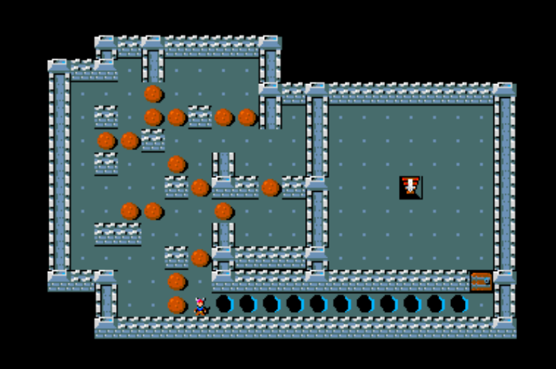

# MiniHack Environment Zoo

This page describes all open-source MiniHack environments developed by its authors as well as members of the community. For adding your own MiniHack environment, please follow the instructions [here](./contributing.md).

## Navigation Tasks

MiniHack navigation tasks challenge the agent to reach the goal position by
overcoming various difficulties on their way, such as fighting monsters in corridors,
crossing rivers by pushing boulders into it, navigating through complex or procedurally generated mazes.
These tasks feature a relatively small action space, i.e., movement towards 8 compass directions, and based on the environment, search, kick, open, and eat actions.

```{toctree}
:hidden: true
:maxdepth: 1
:caption: Navigation Tasks
:name: sec-nav-envs

navigation/room
navigation/corridor
navigation/keyroom
navigation/mazewalk
navigation/river
navigation/hidenseek
navigation/battle
navigation/memento
navigation/explore
```

| Environment Family                    | Capability           | Screenshots                  |
| ------------------------------------- | -------------------- | ---------------------------- |
| [Room](./navigation/room)             | Basic Learning       |         |
| [Corridor](./navigation/corridor)     | Exploration          |     |
| [KeyRoom](./navigation/keyroom)       | Exploration          |      |
| [MazeWalk](./navigation/mazewalk)     | Exploration & Memory |     |
| [River](./navigation/river)           | Planning             |        |
| [HideNSeek](./navigation/hidenseek)   | Planning             |    |
| [CorridorBattle](./navigation/battle) | Planning & Memory    |        |
| [Memento](./navigation/memento)       | Memory               |       |
| [MazeExplore](./navigation/explore)   | Deep Exploration     |  |


## Skill Acquisition Tasks

MiniHack's skill acquisition tasks enable utilising the rich diversity of NetHack
objects, monsters and dungeon features, and the interactions between them. 
The skill acquisition tasks feature a large action space (75 actions), where the actions are instantiated differently depending on which object they are acting on.
Note that certain actions in skill acquisition tasks are factorised autoregresively,
i.e., require performing a sequence of follow-up actions for the initial action to have an effect. For
example, to put on a ring, the agent needs to select the `PUTON` action, choose the ring from the
inventory and select which hand to put it on.

```{toctree}
:hidden: true
:maxdepth: 1
:caption: Skill Acquisition Tasks
:name: sec-skill-envs

skills/simple_skills
skills/lava_cross
skills/wod
skills/quest
```

| Environment Family                      | Screenshots                   |
| --------------------------------------- | ----------------------------- |
| [Simple Skills](./skills/simple_skills) |  |
| [Lava Crossing](./skills/lava_cross)    |      |
| [Wand Of Death](./skills/wod)           |            |
| [Quest](./skills/quest)                 |     |

<!-- The nature of actions in NetHack requires the agent to
perform a sequence of subsequent actions so that the initial action, which is
meant for interaction with an object, has an effect. The exact sequence of
subsequent actions can be inferred by the in-game message bar
prompts. Hence the messages are also used as part of observations in
the skill acquisition tasks. For example, when located in the same grid with
an apple lying on the floor, selecting the `Eat` action will not be
enough for the agent to eat it. In this case, the message bar will ask the
following question: _"There is an apple here; eat it? [ynq] (n)_".
Choosing the `Y` action at the next timestep will cause the initial
`EAT` action to take effect, and the agent will actually eat the apple.
On the other hand, selecting the `N` action will decline the previous `EAT` action prompt.
The rest of the actions will not progress the in-game timer and the agent will stay in the same state.
We refer to this skill as `Confirmation`.

The `PickUp` skill requires to pick up objects from the floor first and
put in the inventory. The tasks with `InventorySelect` skill necessities
selecting an object from the inventory using corresponding key, for example
_"What do you want to wear? [fg or ?*]"_ or _"What do you want to
zap? [f or ?*]"_. The `Direction` skill requires to choose one of the
moving directions for applying the selected action, e.g., kicking or zapping
certain types of wands. In this case, _"In what direction?"_ message
will appear on the screen. The `Navigation` skill tests the agent's
ability to solve various mazes and labyrinths using the moving commands. -->

## Ported tasks

These tasks are ported to MiniHack from other existing benchmarks. Note that there might be substantial differences in MiniHack versions of these tasks. Despite these, the core capabilities of the tasks should be the same. Furthermore, some of the tasks have been extended to become more challenging using the entities and environment dynamics of MiniHack.

```{toctree}
:hidden: true
:maxdepth: 1
:caption: Ported Tasks
:name: sec-ported-envs

ported/minigrid
ported/boxoban
```

| Environment Family            | Screenshots               |
| ----------------------------- | ------------------------- |
| [MiniGrid](./ported/minigrid) |  |
| [Boxoban](./ported/boxoban)   |    |
| [NetHack Sokoban](./ported/sokoban)   |    |
