# MiniHack Environments

This document describes all the tasks that ship with MiniHack. Note that all environements
are registered with the `MiniHack-` prefix and `-v0` suffix.

## Navigation Tasks

### Room
These tasks are set in a single square room, where the goal is to reach the
staircase down. There are multiple variants of this level. There are two sizes
of the room (`5x5, 15x15`). In the simplest variants, (`Room-5x5`
and `Room-15x15`), the start and goal position are fixed. In the
`Room-Random-5x5` and `Room-Random-15x15` tasks, the start and
goal position are randomised. The rest of the variants add additional
complexity to the randomised version of the environment by introducing monsters
(`Room-Monster-5x5` and `Room-Monster-15x15`), teleportation traps
(`Room-Trap-5x5` and `Room-Trap-15x15`), darkness
(`Room-Dark-5x5` and `Room-Dark-15x15`), or all three combined
(`Room-Ultimate-5x5` and `Room-Ultimate-15x15`). The
agent can attack monsters by moving towards them when located in an adjacent
grid cell. Stepping on a lava tile instantly kills the agent. When the room is
dark, the agent can only observe adjacent grid cells.

Examples of the `Room-Ultimate-15x15` task:

### Corridor
These tasks make use of the `RANDOM_CORRIDORS`
command in the `des-file`. The objective is to reach the staircase down, which
is in a random room. The agent is also
in a random room. The rooms have randomised positions and sizes. The corridors
between the rooms are procedurally generated and are different for every
episodes. Different variants of this environment have different numbers of
rooms, making the exploration challenge more difficult (`Corridor-R2`,
`Corridor-R3`, and `Corridor-R5` environments are composed of 2,
3, and 5 rooms, respectively).

Examples of the `Corridor-R5` task:

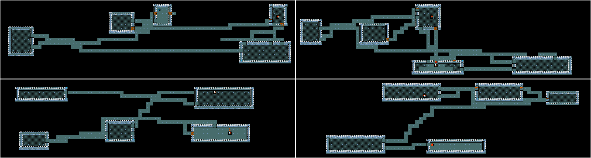

### KeyRoom
These tasks require an agent to pickup a key, navigate to
a door, and use the key to unlock the door, reaching the staircase down within
the locked room. The action space is the standard movement actions plus the
pickup and apply action. In the simplest variant of this task,
(`KeyRoom-Fixed-S5`), the location of the key, door and staircase are
fixed. In the rest of the variants these locations randomised. The size the
outer room is 5x5 for `KeyRoom-S5` and 15x15 for `KeyRoom-S15`.
To increase the difficulty of the tasks, dark versions of the tasks are
introduced (`KeyRoom-Dark-S5` and `KeyRoom-Dark-S15`), where the
key cannot be seen if it is not in any of the agent's adjacent grid cells.

Examples of the `KeyRoom-S15` task:

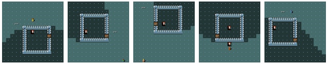

### MazeWalk
These navigation tasks make use of the `MAZEWALK`
command in the `des-file`, which procedurally generates diverse mazes on the
9x9, 15x15 and 45x19 grids for `MazeWalk-9x9`, `MazeWalk-15x15`,
and `MazeWalk-45x19` environments. In the mapped versions of these tasks
(`MazeWalk-Mapped-9x9`, `MazeWalk-Mapped-15x15`, and
`MazeWalk-Mapped-45x19`), the map of the maze and the goal's locations
are visible to the agent.

Examples of the `MazeWalk-15x15` task:

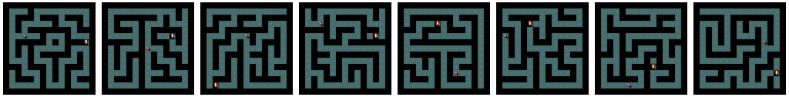

### River
This group of tasks requires the agent to cross a river
using boulders. Boulders, when pushed into water, create a dry land to walk on,
allowing the agent to cross it. While the `River-Narrow` task can be
solved by pushing one boulder into the water, other `River` require the
agent plan a sequence of at least two boulder pushes into the river next to
each other. In the more challenging tasks of the group, the agent needs to
additionally fight monsters (`River-Monster`), avoid pushing boulders
into lava rather than water (`River-Lava`), or both
(`River-MonsterLava`).

Examples of the `River` task:

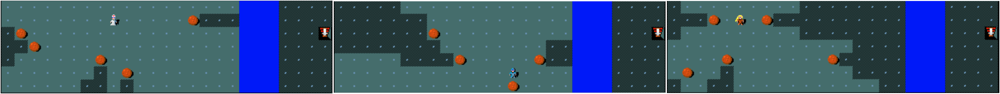

### HideNSeek
In the `HideNSeek` task, the agent is spawned in
a big room full of trees and clouds. The trees and clouds block the line of
sight of the player and a random monster (chosen to be more powerful than the
agent). The agent, monsters and spells can pass through clouds unobstructed.
The agent and monster cannot pass through trees. The goals is to make use of
the environment features, avoid being seen by the monster and quickly run
towards the goal. The layout of the map is procedurally generated, hence
requires systematic generalisation. Alternative versions of this task
additionally include lava tiles that need to be avoided
`HideNSeek-Lava`, have bigger size `HideNSeek-Big`, or provide
the locations of all environment features but not the powerful monster
`HideNSeek-Mapped`.

Examples of the `HideNSeek` task:

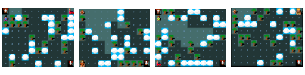

### CorridorBattle
The `CorridorBattle` task challenges the
agent to make best use of the dungeon features to effectively defeat a horde of
hostile monsters. Here, if the agent lures the rats
into the narrow corridor, it can defeat them one at a time. Fighting in rooms,
on the other hand, would result the agent simultaneously incurring damage from
several directions and a quick death. The task also is offered in dark mode
(`CorridorBattle-Dark`), challenging the agent to remember the number of
rats killed in order to plan subsequent actions.

An example of the `CorridorBattle` task:

### Memento
This group of tasks test the agent's ability to use memory
(within an episode) to pick the correct path. The agent is presented with a
prompt (in the form of a sleeping monster of a specific type), and then
navigates along a corridor. At the end of the corridor the agent reaches a
fork, and must choose a direction. One direction leads to a grid bug, which if
killed terminates the episode with +1 reward. All other directions lead to
failure through a invisible trap that terminates the episode when activated.
The correct path is determined by the cue seen at the beginning of the episode.
We provide three versions of this environment: one with a short corridor before
a fork with two paths to choose from (`Memento-Short-F2`), one with a
long corridor with a two-path fork (`Memento-F2`), and one with a long
corridor and a four-fork path (`Memento-F4`).

An example of the `Memento-F4` task:

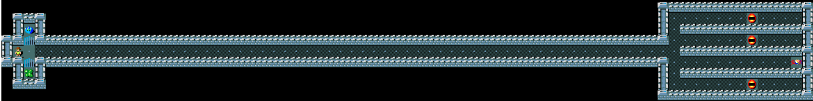

### MazeExplore
These tasks test the agent's ability to perform deep
exploration . It's inspired by the Apple-Gold domain from
, where a small reward can be achieved easily, but to learn
the optimal policy deeper exploration is required. The agent must first explore
a simple randomised maze to reach the staircase down, which they can take for
+1 reward. However, if they navigate through a further randomised maze, they
reach a room with apples. Eating the apples gives +0.5 reward, and once the
apples are eaten the agent should then return to the staircase down. We provide
an easy and a hard version of this task (`MazeExplore-Easy` and
`MazeExplore-Hard`), with the harder version having a larger maze both
before and after the staircase down. Variants can also be mapped
(`MazeExplore-Easy-Mapped` and `MazeExplore-Hard-Mapped`), where
the agent can observe the layout of the entire grid, making it easier to
navigate the maze. Even in the mapped setting the apples aren't visible until
the agent reaches the final room.

Examples of the `MazeExplore-Hard` task. The apples are located near the right
vertical wall (unobservable in the figure). The goal is located in the middle
area of the grid.

### Table of navigation tasks

| Name                         | Capability           |
|------------------------------|----------------------|
| `Room-5x5-v0`                | Basic Learning       |
| `Room-15x15-v0`              | Basic Learning       |
| `Room-Random-5x5-v0`         | Basic Learning       |
| `Room-Random-15x15-v0`       | Basic Learning       |
| `Room-Dark-5x5-v0`           | Basic Learning       |
| `Room-Dark-15x15-v0`         | Basic Learning       |
| `Room-Monster-5x5-v0`        | Basic Learning       |
| `Room-Monster-15x15-v0`      | Basic Learning       |
| `Room-Trap-5x5-v0`           | Basic Learning       |
| `Room-Trap-15x15-v0`         | Basic Learning       |
| `Room-Ultimate-5x5-v0`       | Basic Learning       |
| `Room-Ultimate-15x15-v0`     | Basic Learning       |
| `Corridor-R2-v0`             | Exploration          |
| `Corridor-R3-v0`             | Exploration          |
| `Corridor-R5-v0`             | Exploration          |
| `KeyRoom-Fixed-S5-v0`        | Exploration          |
| `KeyRoom-S5-v0`              | Exploration          |
| `KeyRoom-Dark-S5-v0`         | Exploration          |
| `KeyRoom-S15-v0`             | Exploration          |
| `KeyRoom-Dark-S15-v0`        | Exploration          |
| `MazeWalk-9x9-v0`            | Exploration & Memory |
| `MazeWalk-Mapped-9x9-v0`     | Exploration & Memory |
| `MazeWalk-15x15-v0`          | Exploration & Memory |
| `MazeWalk-Mapped-15x15-v0`   | Exploration & Memory |
| `MazeWalk-45x19-v0`          | Exploration & Memory |
| `MazeWalk-Mapped-45x19-v0`   | Exploration & Memory |
| `River-Narrow-v0`            | Planning             |
| `River-v0`                   | Planning             |
| `River-Monster-v0`           | Planning             |
| `River-Lava-v0`              | Planning             |
| `River-MonsterLava-v0`       | Planning             |
| `HideNSeek-v0`               | Planning             |
| `HideNSeek-Mapped-v0`        | Planning             |
| `HideNSeek-Lava-v0`          | Planning             |
| `HideNSeek-Big-v0`           | Planning             |
| `CorridorBattle-v0`          | Planning & Memory    |
| `CorridorBattle-Dark-v0`     | Planning & Memory    |
| `Memento-Short-F2-v0`        | Memory               |
| `Memento-F2-v0`              | Memory               |
| `Memento-F4-v0`              | Memory               |
| `MazeExplore-Easy-v0`        | Deep Exploration     |
| `MazeExplore-Hard-v0`        | Deep Exploration     |
| `MazeExplore-Easy-Mapped-v0` | Deep Exploration     |
| `MazeExplore-Hard-Mapped-v0` | Deep Exploration     |

## Skill Acquisition Tasks

The nature of actions in NetHack requires the agent to
perform a sequence of subsequent actions so that the initial action, which is
meant for interaction with an object, has an effect. The exact sequence of
subsequent actions can be inferred by the in-game message bar
prompts. Hence the messages are also used as part of observations in
the skill acquisition tasks. For example, when located in the same grid with
an apple lying on the floor, choosing the `Eat` action will not be
enough for the agent to eat it. In this case, the message bar will ask the
following question: _"There is an apple here; eat it? [ynq] (n)_".
Choosing the `Y` action at the next timestep will cause the initial
`EAT` action to take effect, and the agent will eat the apple. Choosing
the `N` action (or `MORE` action since `N` is the default
choice) will decline the previous `EAT` action prompt. The rest of the
actions will not progress the in-game timer and the agent will stay in the same
state. We refer to this skill as `Confirmation`.

The `PickUp` skill requires to pick up objects from the floor first and
put in the inventory. The tasks with `InventorySelect` skill necessities
selecting an object from the inventory using corresponding key, for example
_"What do you want to wear? [fg or ?*]"_ or _"What do you want to
zap? [f or ?*]"_. The `Direction` skill requires to choose one of the
moving directions for applying the selected action, e.g., kicking or zapping
certain types of wands. In this case, _"In what direction?"_ message
will appear on the screen. The `Navigation` skill tests the agent's
ability to solve various mazes and labyrinths using the moving commands.

### Simple Tasks
 The simplest skill acquisition tasks require
discovering interaction between one object and the actions of the agent. These
include: eating comestibles (`Eat`), praying on an altar
(`Pray`), wearing armour (`Wear`), and kicking locked doors
(`LockedDoors`). In the regular versions of these tasks, the starting
location of the objects and the agent is randomised, whereas in the fixed
versions of these tasks (`Eat-Fixed`, `Pray-Fixed`,
`Wear-Fixed` and `LockedDoors-Fixed`) both are fixed. To add a
slight complexity to the randomised version of these tasks, distractions in the
form of a random object and a random monster are added to the third version of
these tasks (`Eat-Distract`, `Pray-Distract` and
`Wear-Distract`). These tasks can be used as building blocks for more
advanced skill acquisition tasks.

Examples of `Eat-Distract`, `Wear-Distract` and `Pray-Distract`:

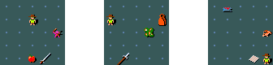

### Lava Crossing
 An example of a more advanced task involves crossing
a river of lava. The agent can accomplish this by either levitating over it
(via a potion of levitation or levitation boots) or freezing it (by zapping the
wand of cold or playing the frost horn). In the simplest version of the task
(`LavaCross-Levitate-Potion-Inv` and
`LavaCross-Levitate-Ring-Inv`), the agent starts with one of the
necessary objects in the inventory. Requiring the agent to pickup the
corresponding object first makes the tasks more challenging
(`LavaCross-Levitate-Potion-PickUp` and
`LavaCross-Levitate-Ring-PickUp`). Most difficult variants of this task
group require the agent to cross the lava river using one of the appropriate
objects randomly sampled and placed at the random location. In
`LavaCross-Levitate`, one of the objects of levitation is placed on the
map, while in the `LavaCross` task these include all of the objects for
levitation as well as freezing.

 Five random instances of the `LavaCross` task, where the agent needs to cross
 the lava using (i) potion of levitation, (ii) ring of levitation, (iii)
 levitation boots, (iv) frost horn, or (v) wand of cold.

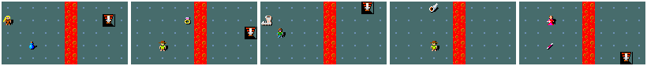

### Wand of Death
 MiniHack is very convenient for making incremental
changes to the difficulty of a task. To illustrate this, we provide a sequence
of tasks that require mastering the usage of the wand of death. Zapping a WoD it in any direction fires a death ray which
instantly kills almost any monster it hits. In `WoD-Easy` environment,
the agent starts with a WoD in its inventory and needs to zap it towards a
sleeping monster. `WoD-Medium` requires the agent pick it up, approach
the sleeping monster, kill it, and go to staircase. In `WoD-Hard` the
WoD needs to be found first, only then the agent should enter the corridor with
a monster (who is awake and hostile this time), kill it, and go to the
staircase. In the most difficult task of the sequence, the `WoD-Pro`,
the agent starts inside a big labyrinth. It needs to find the WoD inside the
maze and reach its centre, which is guarded by a deadly Minotaur.

An example of the `WoD-Hard` task:

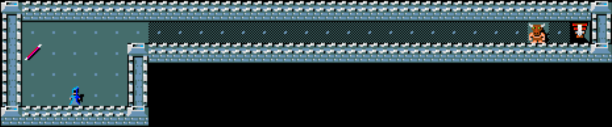

### Quest
 In the `Quest` tasks, the agents first needs
to cross a river of lava with whichever object it can find, which can be any
object allowing levitation or freezing. On the opposite side of the river, it
needs to find the key, use it to open a hidden chest in order to locate the
WoD. The WoD is required to kill the powerful monster standing between the
agent and the goal. In `Quest_Easy`, the map layout is relatively
simple and fixed, whereas in the `Quest_Pro` version it is procedurally
generated and also requires navigation through complicated mazes.

Examples of the `Quest-Hard` task:

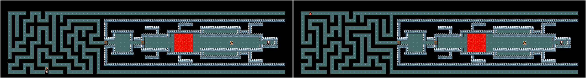

### Table of skill acquisition tasks

| Name                                  | Skill                                 |
|---------------------------------------|---------------------------------------|
| `Eat-v0`                              | Confirmation or PickUp+Inventory      |
| `Eat-Fixed-v0`                        | Confirmation or PickUp+Inventory      |
| `Eat-Distract-v0`                     | Confirmation or PickUp+Inventory      |
| `Pray-v0`                             | Confirmation                          |
| `Pray-Fixed-v0`                       | Confirmation                          |
| `Pray-Distract-v0`                    | Confirmation                          |
| `Wear-v0`                             | PickUp+Inventory                      |
| `Wear-Fixed-v0`                       | PickUp+Inventory                      |
| `Wear-Distract-v0`                    | PickUp+Inventory                      |
| `LockedDoor-v0`                       | Direction                             |
| `LockedDoor-Random-v0`                | Direction                             |
| `LavaCross-Levitate-Ring-Inv-v0`      | Inventory                             |
| `LavaCross-Levitate-Potion-Inv-v0`    | Inventory                             |
| `LavaCross-Levitate-Ring-Pickup-v0`   | PickUp+Inventory                      |
| `LavaCross-Levitate-Potion-PickUp-v0` | PickUp+Inventory                      |
| `LavaCross-Levitate-v0`               | PickUp+Inventory                      |
| `LavaCross-v0`                        | PickUp+Inventory                      |
| `WoD-Easy`                            | Inventory+Direction                   |
| `WoD-Medium`                          | PickUp+Inventory+Direction            |
| `WoD-Hard`                            | PickUp+Inventory+Direction            |
| `WoD-Pro`                             | Navigation+PickUp+Inventory+Direction |
| `Quest-Easy-v0`                       | Inventory                             |
| `Quest-Medium-v0`                     | Navigation+Inventory                  |
| `Quest-Hard-v0`                       | Navigation+PickUp+Inventory+Direction |

## Ported tasks

The full list of tasks ported to MiniHack from [MiniGrid](https://github.com/maximecb/gym-minigrid)
and [Boxoban](https://github.com/deepmind/boxoban-levels) which we used in our experiments is
provided in the table below. Note that more tasks could have similarly been ported from MiniGrid.
However, our goal is to showcase MiniHack's ability to port existing gridworld environments and easily
enrich them, rather then porting all possible tasks.

Examples of `MultiRoom-N4` and `MultiRoom-N4-Extreme` environments rendered using MiniHack's tiles:

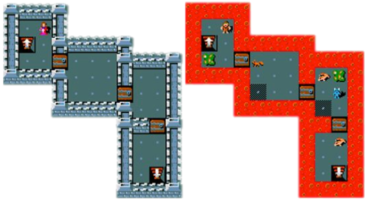

An example a `Boxoban` environment rendered using MiniHack's tiles:

### Table of ported tasks

| Name                                         | Capability  |
|----------------------------------------------|-------------|
| `MultiRoom-N2-v0`                            | Exploration |
| `MultiRoom-N4-v0`                            | Exploration |
| `MultiRoom-N2-Monster-v0`                    | Exploration |
| `MultiRoom-N4-Monster-v0`                    | Exploration |
| `MultiRoom-N2-Locked-v0`                     | Exploration |
| `MultiRoom-N4-Locked-v0`                     | Exploration |
| `MultiRoom-N2-Lava-v0`                       | Exploration |
| `MultiRoom-N4-Lava-v0`                       | Exploration |
| `MultiRoom-N2-Extreme-v0`                    | Exploration |
| `MultiRoom-N4-Extreme-v0`                    | Exploration |
| `Boxoban-Unfiltered-v0`                      | Planning    |
| `Boxoban-Medium-v0`                          | Planning    |
| `Boxoban-Hard-v0`                            | Planning    |

