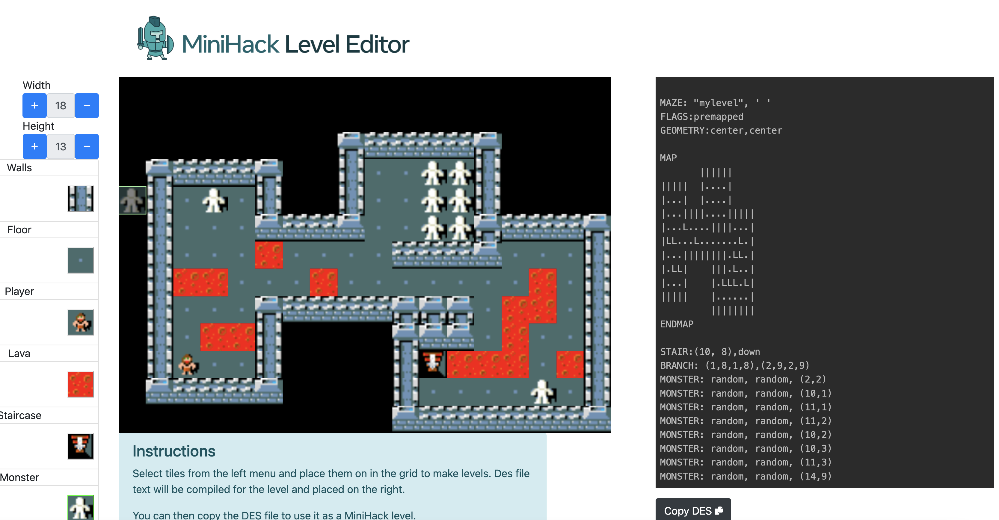

# Level Editor

## Overview

The MiniHack Level Editor allows to easily define MiniHack environments inside a browser using a convenient drag-and-drop functionality. Once the level has been designed using the user interface, its description file can be easily copied and applied to the downstream codebase.

## Accessing the Level Editor

The MiniHack level editor can be accessed at [minihack-editor.github.io](https://minihack-editor.github.io). Please follow the instructions on the website for generating description files of the designed levels.

