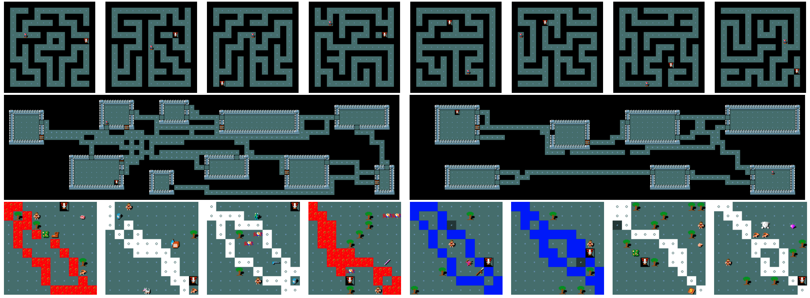

# MiniHack



MiniHack is a sandbox framework for easily designing rich and diverse environments for Reinforcement Learning (RL) research.
Based on the game of [NetHack](./about/nethack), arguably the hardest grid-based game in the world, MiniHack uses the [NetHack Learning Environment (NLE)](./nethack#nethack-learning-environment) to provide a convenient [Gym interface](https://github.com/openai/gym) for for customly created RL tesbeds.

MiniHack already comes with a large list of challenging tasks.
However, it is primarily built for easily designing new ones.
The motivation behind MiniHack is to be able to perform RL
experiments in a controlled setting while being able to increasingly
scale the complexity of the tasks.

To this end, MiniHack leverages the [description files](./getting-started/des_files) of NetHack. The description files (or des-files) are human-readable specifications of levels: distributions of grid layouts together with monsters, objects on the floor, environment features (e.g. walls, water, lava), etc. The developers of NetHack created a special domain-specific language for describing the levels of the game, called _des-file format_. The des-files can be compiled into binary using the NetHack level compiler, and MiniHack maps them to [Gym environments](https://github.com/openai/gym).


This documentation will walk you through everything you need to know, step-by-step.
Start with [installing MiniHack](getting-started/installation), [try it out](getting-started/trying_out), [design new envirionments](getting-started/interface) and [train RL agents](agents/torchbeast).


```{toctree}
:hidden: true
:maxdepth: 1
:caption: Getting Started
:name: sec-getting-started

getting-started/installation
getting-started/trying_out
getting-started/observation_spaces
getting-started/action_spaces
getting-started/des_files
getting-started/interface
getting-started/reward
```

```{toctree}
:hidden: true
:maxdepth: 1
:caption: Environments
:name: sec-envs

envs/tasks
```

```{toctree}
:hidden: true
:maxdepth: 1
:caption: Tutorials
:name: sec-tutorials

tutorials/des_file_tutorial.ipynb
```

```{toctree}
:hidden: true
:maxdepth: 1
:caption: Agents
:name: sec-agents

agents/torchbeast
agents/rllib
agents/ued
agents/other
```

```{toctree}
:hidden: true
:maxdepth: 1
:caption: API
:name: sec-api

api/minihack
```

```{toctree}
:hidden: true
:maxdepth: 1
:caption: References
:name: sec-refs

about/references
about/nethack
```
