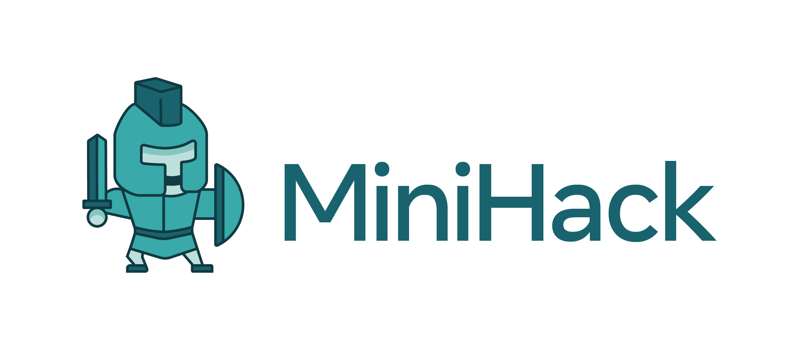
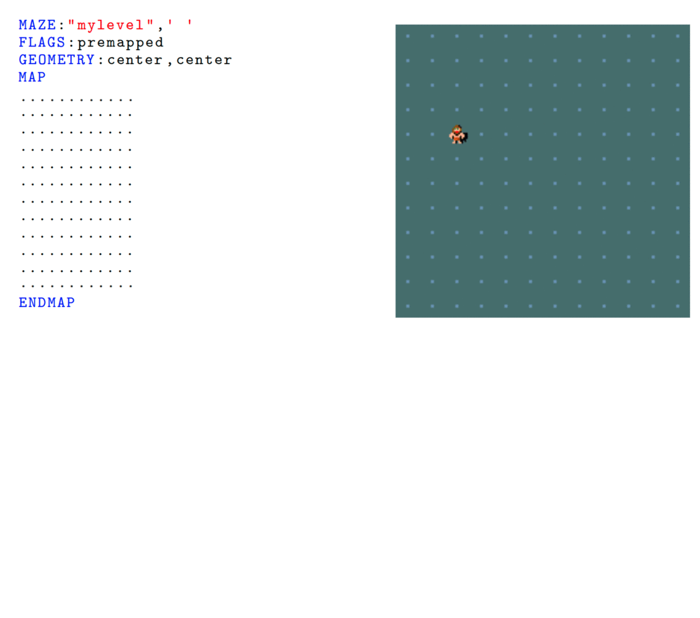

# MiniHack



MiniHack is a sandbox framework for easily designing rich and diverse environments for Reinforcement Learning (RL).
Based on the game of [NetHack](./about/nethack), MiniHack uses the [NetHack Learning Environment (NLE)](https://github.com/facebookresearch/nle) to communicate with the game and to provide a convenient interface for customly created RL training and test environments of varying complexity. Check out our [NeurIPS 2020 paper](https://arxiv.org/abs/2109.13202) and recent [blogpost](https://ai.facebook.com/blog/minihack-a-new-sandbox-for-open-ended-reinforcement-learning).

MiniHack comes with a large list of challenging [tasks](./envs/tasks.md). However, it is primarily built for easily designing new ones.
The motivation behind MiniHack is to be able to perform RL experiments in a controlled setting while being able to increasingly scale the complexity of the tasks.
MiniHack already comes with a large list of challenging tasks.

To do this, MiniHack leverages the so-called [description files](https://nethackwiki.com/wiki/Des-file_format) written using a human-readable probabilistic-programming-like domain-specific language. With just a few lines of code, people can generate a large variety of [Gym](https://github.com/openai/gym) environments, controlling every little detail, from the location and types of monsters, to the traps, objects, and terrain of the level, all while introducing randomness that challenges generalization capabilities of RL agents.

This documentation will walk you through everything you need to know, step-by-step.
Start with [installing MiniHack](getting-started/installation), [try it out](getting-started/trying_out), [design new envirionments](getting-started/interface) and [train RL agents](agents/torchbeast).




```{toctree}
:hidden: true
:maxdepth: 1
:caption: Getting Started
:name: sec-getting-started

getting-started/installation
getting-started/trying_out
getting-started/observation_spaces
getting-started/action_spaces
getting-started/des_files
getting-started/interface
getting-started/reward
```

```{toctree}
:hidden: true
:maxdepth: 1
:caption: Environments
:name: sec-envs

envs/tasks
```

```{toctree}
:hidden: true
:maxdepth: 1
:caption: Tutorials
:name: sec-tutorials

tutorials/des_file_tutorial.ipynb
```

```{toctree}
:hidden: true
:maxdepth: 1
:caption: Agents
:name: sec-agents

agents/torchbeast
agents/rllib
agents/ued
agents/other
```

```{toctree}
:hidden: true
:maxdepth: 1
:caption: API
:name: sec-api

api/minihack
```

```{toctree}
:hidden: true
:maxdepth: 1
:caption: References
:name: sec-refs

about/references
about/nethack
```
